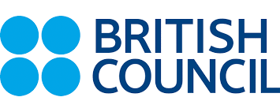

# Introduccion a github
## Charla-Tallet

Taller desarrollado por el **Google Developer Student Club de la Universidad Autónoma de Guanajuato**, en colaboración por parte del programa _**Skills for women in Tech**_ y junto a **British Council** para la capacitacón-actualización de un grupo de estudiantes y profesores de la Casa de Estudios. 

 Sesion de github

 ### Insertaremos una imagen 

 
